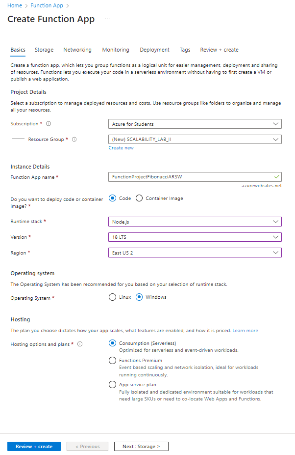
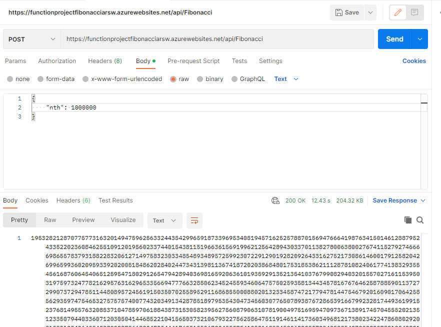
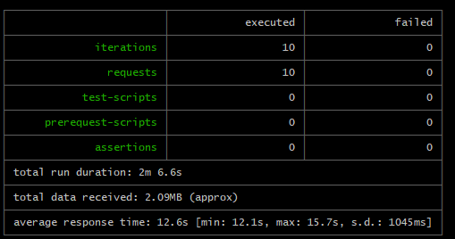
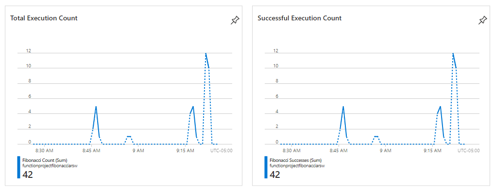

### Escuela Colombiana de Ingeniería
### Arquitecturas de Software - ARSW

## Escalamiento en Azure con Maquinas Virtuales, Sacale Sets y Service Plans

### Dependencias
* Cree una cuenta gratuita dentro de Azure. Para hacerlo puede guiarse de esta [documentación](https://azure.microsoft.com/es-es/free/students/). Al hacerlo usted contará con $100 USD para gastar durante 12 meses.
Antes de iniciar con el laboratorio, revise la siguiente documentación sobre las [Azure Functions](https://www.c-sharpcorner.com/article/an-overview-of-azure-functions/)

### Parte 0 - Entendiendo el escenario de calidad

Adjunto a este laboratorio usted podrá encontrar una aplicación totalmente desarrollada que tiene como objetivo calcular el enésimo valor de la secuencia de Fibonnaci.

**Escalabilidad**
Cuando un conjunto de usuarios consulta un enésimo número (superior a 1000000) de la secuencia de Fibonacci de forma concurrente y el sistema se encuentra bajo condiciones normales de operación, todas las peticiones deben ser respondidas y el consumo de CPU del sistema no puede superar el 70%.

### Escalabilidad Serverless (Functions)

1. Cree una Function App tal cual como se muestra en las  imagenes.

2. Instale la extensión de **Azure Functions** para Visual Studio Code.

3. Despliegue la Function de Fibonacci a Azure usando Visual Studio Code. La primera vez que lo haga se le va a pedir autenticarse, siga las instrucciones.

4. Dirijase al portal de Azure y pruebe la function.

### Evidencias

5. Modifique la coleción de POSTMAN con NEWMAN de tal forma que pueda enviar 10 peticiones concurrentes. Verifique los resultados y presente un informe.

6. Cree una nueva Function que resuleva el problema de Fibonacci pero esta vez utilice un enfoque recursivo con memoization. Pruebe la función varias veces, después no haga nada por al menos 5 minutos. Pruebe la función de nuevo con los valores anteriores. ¿Cuál es el comportamiento?.

  Aplicando memoization a la función de Fibonacci, se puede ver que la función solo sirve para número pequeños pero con número muy altos como 1000000 no sirve en el entorno de Node.js.

**Preguntas**

* ¿Qué es un Azure Function?

  Azure Functions es un servicio en la nube disponible a petición que proporciona toda la infraestructura y los recursos, que se actualizan continuamente, necesarios para ejecutar las aplicaciones. Céntrese en el código que más le importa, en el lenguaje más productivo, y Functions se encargará del resto. Functions proporciona proceso sin servidor para Azure. Functions también se puede usar para crear API web, responder a los cambios en las bases de datos, procesar secuencias de IoT, administrar colas de mensajes, etc.

* ¿Qué es serverless?

  Serverless significa sin servidor, es una solución que permite crear y ejecutar aplicaciones con rapidez y menor costo total de propiedad, ya que no es necesario aprovisionar y administrar infraestructura. Evidentemente, por detrás hay servidores para ejecutar las aplicaciones, pero el proveedor de nube se encarga de la administración, por lo tanto, de nuestro lado dejamos de preocuparnos por administrar servidores, sistemas operativos, software y demás recursos, y únicamente nos centramos en el código de la aplicación.

* ¿Qué es el runtime y que implica seleccionarlo al momento de crear el Function App?

  El runtime stack es el lenguaje que se va a utilizar en la function app. El lenguaje de la función se mantiene en la configuración FUNCTIONS_WORKER_RUNTIME y no se debería cambiar una vez ya creada la función.
  
  Azure soporta los siguientes lenguajes en function app:
  
  - .NET
  - Java
  - Python
  - Node.js
  - PowerShell
  
* ¿Por qué es necesario crear un Storage Account de la mano de un Function App?
  
  Las Azure Function App utilizan el almacenamiento de Azure para guardar los registros de registro y los datos de estado para la ejecución de funciones.
  
  Además, el Storage Account proporciona un lugar para almacenar archivos de datos que se utilizan en las funciones. También se puede utilizar para almacenar archivos de configuración o para compartir datos entre diferentes funciones.
  
* ¿Cuáles son los tipos de planes para un Function App?, ¿En qué se diferencias?, mencione ventajas y desventajas de cada uno de ellos.
  **Plan de consumo:** 
  
  Escala de forma automática y pague los recursos de proceso solo cuando se ejecuten las funciones.
  
  En el plan de consumo, las instancias del host de Functions se agregan y quitan de forma dinámica según el número de eventos de entrada.

  - Plan de hospedaje predeterminado.
  - Pague solo cuando se ejecutan las funciones.
  - Escala de forma automática, incluso durante períodos de carga elevada.
  
  **Plan premium:**
  
  Escala automáticamente en función de la demanda mediante trabajos preparados previamente que ejecutan aplicaciones sin ningún retraso después de estar inactivas, ejecuta en instancias más eficaces y se conecta a redes virtuales.

  Considere la posibilidad de elegir el plan Premium de Azure Functions en las siguientes situaciones:

  - La aplicación de funciones se ejecuta de forma continua, o casi continua.
  - Tiene un gran número de ejecuciones pequeñas y una factura de ejecución elevada, pero pocos GB por segundo en el plan de consumo.
  - Necesita más opciones de CPU o memoria de las que proporciona el plan de consumo.
  - Su código debe ejecutarse durante más tiempo del máximo permitido en el plan de consumo.
  - Necesita características que no están disponibles en el plan de consumo, como la conectividad con red virtual.
  - Quiere proporcionar una imagen personalizada de Linux en la que ejecutar sus funciones.
  
  **Plan dedicado:**
  
  Ejecuta las funciones en un plan de App Service a los Precios de App Service normales.

  Mejor para escenarios de ejecución prolongada en los que no se puede usar Durable Functions. Considere el plan de App Service en las situaciones siguientes:

  - Tiene máquinas virtuales infrautilizadas que ya ejecutan otras instancias de App Service.
  - Se requieren escalado y costos predictivos.
  
* ¿Por qué la memoization falla o no funciona de forma correcta?

  Cuando la función se prueba con números muy grandes como 100000, la pila de llamadas recursivas crece demasiado para el entorno de ejecución de Node.js y manda una excepción (también sale error 500).

* ¿Cómo funciona el sistema de facturación de las Function App?

  El modelo de facturación es conocido como "pago por uso".
  
  Cuando se ejecuta una función, Azure monitoriza el tiempo de ejecución, el consumo de memoria y otros recursos. En función de esto, se realiza un cálculo de los recursos consumidos y se factura en consecuencia.
